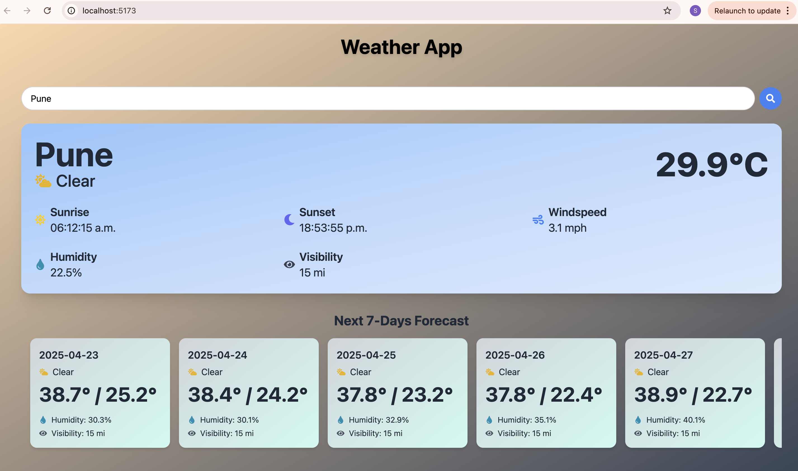

# 🌦️ Weather Forecast App

A weather forecast web app built with **React**, **TypeScript**, and **TailwindCSS**. It fetches real-time weather data (current and next 7 days) using the **Visual Crossing Weather API**.

---

## 🖥️ Screenshot



## 🚀 Setup Instructions

### 1. Clone the Repository

```bash
git clone https://github.com/your-username/weather-app.git
cd weather-app
```

### 2. Install Dependencies

```
npm install
```

### 3. Add your API KEY (VisualCrossing Weather API)

#### or use api key : "S9N8STKQMMB8PZEUGCJKEWEF8"

.config.py

```
export const SECRET_KEY:string = "<your-api-key>"

```

### 4. Run Server

```
npm run dev
```

**App will run at http://localhost:5173**
